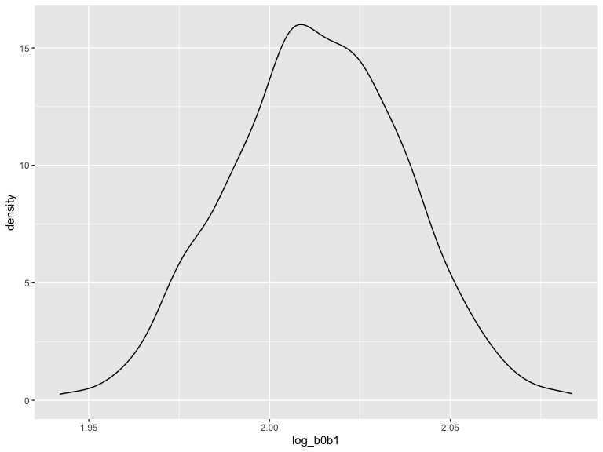
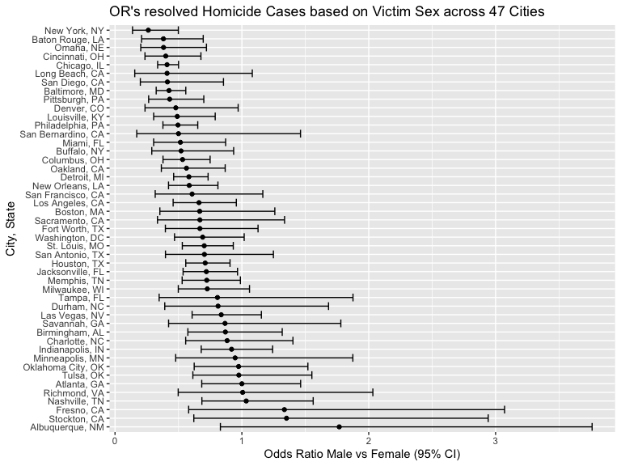
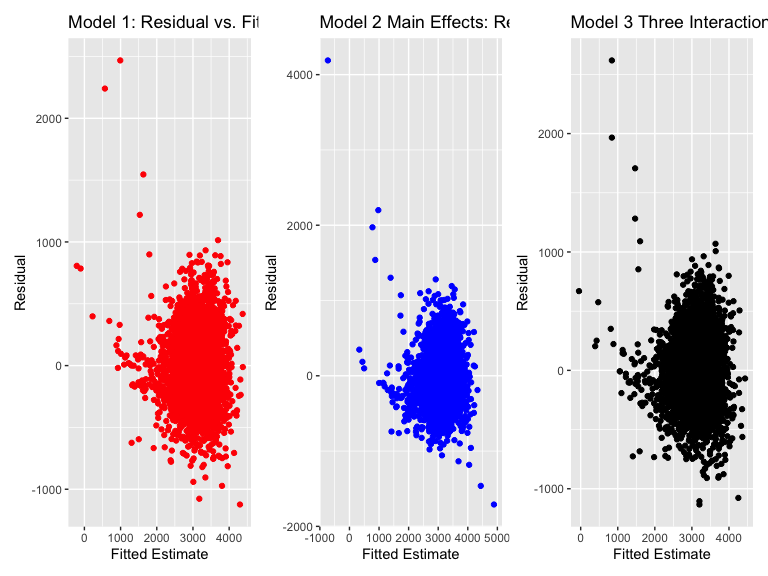

p8105_hw6_kpp2126
================
Kevin P. Patterson
2022-11-26

``` r
library(tidyverse)
```

    ## ── Attaching packages ─────────────────────────────────────── tidyverse 1.3.2 ──
    ## ✔ ggplot2 3.3.6      ✔ purrr   0.3.4 
    ## ✔ tibble  3.1.8      ✔ dplyr   1.0.10
    ## ✔ tidyr   1.2.0      ✔ stringr 1.4.1 
    ## ✔ readr   2.1.2      ✔ forcats 0.5.2 
    ## ── Conflicts ────────────────────────────────────────── tidyverse_conflicts() ──
    ## ✖ dplyr::filter() masks stats::filter()
    ## ✖ dplyr::lag()    masks stats::lag()

``` r
library(dplyr)
library(labelled)
library(patchwork)
#install.packages("ggcorrplot")
library(ggcorrplot)
#install.packages("table1")
library(table1)
```

    ## 
    ## Attaching package: 'table1'
    ## 
    ## The following objects are masked from 'package:base':
    ## 
    ##     units, units<-

``` r
#install.packages("RCurl")
library(RCurl)
```

    ## 
    ## Attaching package: 'RCurl'
    ## 
    ## The following object is masked from 'package:tidyr':
    ## 
    ##     complete

``` r
library(modelr)

knitr::opts_chunk$set(
    echo = TRUE,
    warning = FALSE,
    fig.width = 8, 
  fig.height = 6,
  out.width = "90%"
)
```

## Problem 1

``` r
weather_df = 
  rnoaa::meteo_pull_monitors(
    c("USW00094728"),
    var = c("PRCP", "TMIN", "TMAX"), 
    date_min = "2017-01-01",
    date_max = "2017-12-31") %>%
  mutate(
    name = recode(id, USW00094728 = "CentralPark_NY"),
    tmin = tmin / 10,
    tmax = tmax / 10) %>%
  select(name, id, everything())
```

    ## Registered S3 method overwritten by 'hoardr':
    ##   method           from
    ##   print.cache_info httr

    ## using cached file: ~/Library/Caches/R/noaa_ghcnd/USW00094728.dly

    ## date created (size, mb): 2022-11-26 13:29:46 (8.426)

    ## file min/max dates: 1869-01-01 / 2022-11-30

The boostrap is helpful when you’d like to perform inference for a
parameter / value / summary that doesn’t have an easy-to-write-down
distribution in the usual repeated sampling framework. 1. We’ll focus on
a simple linear regression with tmax as the response and tmin as the
predictor, and are interested in the distribution of two quantities
estimated from these data: $$
\hat{r}^2
$$ $$
log(\hat{\beta_0}*\hat{\beta_1})
$$ \* Use 5000 bootstrap samples and, for each bootstrap sample, produce
estimates of these two quantities.

``` r
weather_df %>% 
  modelr::bootstrap(n = 1000) %>% 
  mutate(
    models = map(strap, ~lm(tmax ~ tmin, data = .x) ),
    results = map(models, broom::glance)) %>% 
  select(-strap, -models) %>% 
  unnest(results) %>% 
  ggplot(aes(x = r.squared)) + geom_density()
```


2.  Plot the distribution of your estimates, and describe these in
    words. Using the 5000 bootstrap estimates, identify the 2.5% and
    97.5% quantiles to provide a 95% confidence interval for r̂ 2 and
    log(β̂ 0∗β̂ 1) \*Note: `broom::glance()` is helpful for extracting r̂ 2
    from a fitted regression, and`broom::tidy()` (with some additional
    wrangling) should help in computing log(β̂ 0∗β̂ 1).

``` r
weather_df %>% 
  modelr::bootstrap(n = 1000) %>% 
  mutate(
    models = map(strap, ~lm(tmax ~ tmin, data = .x) ),
    results = map(models, broom::tidy)) %>% 
  select(-strap, -models) %>% 
  unnest(results) %>% 
  select(id = `.id`, term, estimate) %>% 
  pivot_wider(
    names_from = term, 
    values_from = estimate) %>% 
  rename(beta0 = `(Intercept)`, beta1 = tmin) %>% 
  mutate(log_b0b1 = log(beta0 * beta1)) %>% 
  ggplot(aes(x = log_b0b1)) + geom_density()
```



## Problem 2

``` r
x <- getURL("https://raw.githubusercontent.com/washingtonpost/data-homicides/master/homicide-data.csv")
hom_df <- read.csv(text = x)
```

1.  Create a city_state variable (e.g. “Baltimore, MD”), and a binary
    variable indicating whether the homicide is solved. \*Omit cities
    Dallas, TX; Phoenix, AZ; and Kansas City, MO – these don’t report
    victim race. Also omit Tulsa, AL – this is a data entry mistake. For
    this problem, limit your analysis those for whom victim_race is
    white or black. Be sure that victim_age is numeric.

``` r
tidyhom_df = hom_df %>%
  mutate(city_state = str_c(city, state, sep = ", "), #create city_state variable
         resolved = as.numeric(disposition == "Closed by arrest"), #create 1=resolved or 0=unresolved
         victim_age = as.numeric(victim_age),
         victim_sex = fct_relevel(victim_sex, "Female"),
         city_state = ifelse(city_state %in% c("Milwaukee, wI"), "Milwaukee, WI", city_state),
         victim_race = fct_relevel(victim_race, "White")) %>% #fixing Milwaukee, wI to WI
  filter(!city_state %in% c("Dallas, TX", "Phoenix, AZ", "Kansas City, MO", "Tulsa, AL"),
         victim_race %in% c("White", "Black"),
         !victim_sex %in% c("Unknown")) %>% #39,693 obs before drop_na(victim_age)
  drop_na(victim_age) %>% #39,403 obs after drop_na(victim_age) (290 less)
  select(victim_race, victim_age, victim_sex, city_state, resolved)

##this was used to double check that the NA coercion in as.numeric(victim_age) -> drop_na(victim_age)
#tidyhom_df %>%
#  select(city_state, victim_race, victim_age) %>%
#  filter(victim_age == "Unknown") %>%
#  count #290 unknown ages

##checking totals on number of age 0's
tidyhom_df %>%
  select(city_state, victim_race, victim_age) %>%
  #group_by(city_state) %>%
  filter(victim_age == "0") %>%
  count #297 homicides at age 0
```

    ##     n
    ## 1 296

2.  For the city of Baltimore, MD, use the glm function to fit a
    logistic regression with (`outcome`) resolved vs unresolved as the
    outcome and `victim age`, `sex` and `race` as predictors.

*Save the output of glm as an R object; *Apply the `broom::tidy` to this
object; \*Obtain the estimate and confidence interval of the adjusted
odds ratio for solving homicides comparing male victims to female
victims keeping all other variables fixed.

``` r
#creating logistic Rframe
fit_logistic_baltimore = 
  tidyhom_df %>%
  filter(city_state == "Baltimore, MD") %>%
  glm(resolved ~ victim_age + victim_race + victim_sex, data = ., family = binomial()) 

#table
fit_logistic_baltimore %>% 
  broom::tidy() %>% 
  mutate(OR = exp(estimate),
         OR.ci.low = exp(estimate - 1.96 * std.error),
         OR.ci.high = exp(estimate + 1.96 * std.error)) %>%
  select(term, log_OR = estimate, OR, OR.ci.low, OR.ci.high, p.value) %>% 
  knitr::kable(digits = 3)
```

| term             | log_OR |    OR | OR.ci.low | OR.ci.high | p.value |
|:-----------------|-------:|------:|----------:|-----------:|--------:|
| (Intercept)      |  1.152 | 3.164 |     1.989 |      5.031 |   0.000 |
| victim_age       | -0.007 | 0.993 |     0.987 |      1.000 |   0.043 |
| victim_raceBlack | -0.842 | 0.431 |     0.306 |      0.607 |   0.000 |
| victim_sexMale   | -0.854 | 0.426 |     0.325 |      0.558 |   0.000 |

3.  Now run glm for each of the cities in your dataset; *Extract the
    adjusted odds ratio (and CI) for solving homicides comparing male
    victims to female victims. *Do this within a “tidy” pipeline, making
    use of `purrr::map`, list columns, and unnest as necessary to create
    a dataframe with estimated ORs and CIs for each city.

``` r
glm_all = 
  tidyhom_df %>%
  nest(data = -city_state) %>% #need to remove to resolve issues with select later
  mutate(model = map(data, ~ glm(resolved ~ victim_age + victim_race + victim_sex, data = ., family = binomial())),
         result = map(.x=model, ~broom::tidy(.x,conf.int = TRUE))) %>% 
  select(city_state, result) %>% 
  unnest(result) %>%
  mutate(
    OR = exp(estimate),
    OR.ci.low = exp(estimate - 1.96 * std.error),
    OR.ci.high = exp(estimate + 1.96 * std.error)
  ) %>% 
  select(city_state, term, starts_with("OR")) %>% 
  filter(term == "victim_sexMale")
```

4.  Create a plot that shows the estimated ORs and CIs for each city.
    Organize cities according to estimated OR, and comment on the plot.

``` r
glm_all %>%
  mutate(
    city_state = fct_reorder(city_state, -OR)
  ) %>%
  ggplot(aes(x = OR, y = city_state)) +
  geom_point() +
  geom_errorbar(aes(xmin = OR.ci.low , xmax = OR.ci.high)) +
  labs(title = "OR's resolved Homicide Cases based on Victim Sex across 47 Cities",
       y = "City, State",
       x = "Odds Ratio Male vs Female (95% CI)")
```



\##Problem 3

1.  Load and clean the data for regression analysis (i.e. convert
    numeric to factor where appropriate, check for missing data, etc.).

``` r
##load raw dataframe
birthweight_rawdf =
  read_csv("data/birthweight.csv")
```

    ## Rows: 4342 Columns: 20
    ## ── Column specification ────────────────────────────────────────────────────────
    ## Delimiter: ","
    ## dbl (20): babysex, bhead, blength, bwt, delwt, fincome, frace, gaweeks, malf...
    ## 
    ## ℹ Use `spec()` to retrieve the full column specification for this data.
    ## ℹ Specify the column types or set `show_col_types = FALSE` to quiet this message.

``` r
##check column NA's
birthweight_rawdf %>%
  summarise(across(everything(), ~sum(is.na(.x)))) %>%
  knitr::kable() #no NA's identified
```

| babysex | bhead | blength | bwt | delwt | fincome | frace | gaweeks | malform | menarche | mheight | momage | mrace | parity | pnumlbw | pnumsga | ppbmi | ppwt | smoken | wtgain |
|--------:|------:|--------:|----:|------:|--------:|------:|--------:|--------:|---------:|--------:|-------:|------:|-------:|--------:|--------:|------:|-----:|-------:|-------:|
|       0 |     0 |       0 |   0 |     0 |       0 |     0 |       0 |       0 |        0 |       0 |      0 |     0 |      0 |       0 |       0 |     0 |    0 |      0 |      0 |

``` r
##tidy
birthweight_df =
  birthweight_rawdf %>%
  drop_na() %>% #quality assurance check
  set_value_labels(babysex = c("male" = 1, "female" = 2), 
                   frace = c("white" = 1, "black" = 2, "asian" = 3, "puerto rican" = 4, "other" = 8, "uknown" = 9),
                   malform = c("absent" = 0, "present" = 1),
                   mrace = c("white" = 1, "black" = 2, "asian" = 3, "puerto rican" = 4, "other" = 8)) %>%
  mutate_if(is.labelled, to_factor) 
```

2.  Propose a regression model for birthweight. \*This model may be
    based on a hypothesized structure for the factors that underlie
    birthweight, on a data-driven model-building process, or a
    combination of the two.

**Table 1**

``` r
pvalue <- function(x, ...) {
    # Construct vectors of data y, and groups (strata) g
    y <- unlist(x)
    g <- factor(rep(1:length(x), times=sapply(x, length)))
    if (is.numeric(y)) {
        # For numeric variables, perform a standard 2-sample t-test
        p <- t.test(y ~ g)$p.value
    } else {
        # For categorical variables, perform a chi-squared test of independence
        p <- chisq.test(table(y, g))$p.value
    }
    # Format the p-value, using an HTML entity for the less-than sign.
    # The initial empty string places the output on the line below the variable label.
    c("", sub("<", "&lt;", format.pval(p, digits=3, eps=0.001)))
}

table1(~ bwt + bhead + blength + delwt + fincome + frace + gaweeks + malform + menarche + mheight + momage + mrace + parity + pnumlbw + pnumsga + ppbmi + ppwt + smoken + wtgain | babysex,
    data=birthweight_df, overall=F, extra.col=list(`P-value`=pvalue))
```

    ##                                      male             female   P-value
    ## 1                                (N=2230)           (N=2112)          
    ## 2                  bwt                                                
    ## 3            Mean (SD)         3160 (523)         3070 (497) &lt;0.001
    ## 4    Median [Min, Max]   3180 [624, 4790]   3090 [595, 4790]          
    ## 5                bhead                                                
    ## 6            Mean (SD)        33.9 (1.62)        33.4 (1.58) &lt;0.001
    ## 7    Median [Min, Max]  34.0 [23.0, 41.0]  33.0 [21.0, 38.0]          
    ## 8              blength                                                
    ## 9            Mean (SD)        50.0 (2.75)        49.5 (2.66) &lt;0.001
    ## 10   Median [Min, Max]  50.0 [20.0, 63.0]  50.0 [31.0, 58.0]          
    ## 11               delwt                                                
    ## 12           Mean (SD)         146 (21.7)         145 (22.7)      0.28
    ## 13   Median [Min, Max]    143 [92.0, 334]    142 [86.0, 286]          
    ## 14             fincome                                                
    ## 15           Mean (SD)        44.7 (25.6)        43.5 (26.4)     0.136
    ## 16   Median [Min, Max]  35.0 [5.00, 96.0]     35.0 [0, 96.0]          
    ## 17               frace                                                
    ## 18               white       1120 (50.2%)       1003 (47.5%)        NA
    ## 19               black        963 (43.2%)        948 (44.9%)          
    ## 20               asian          28 (1.3%)          18 (0.9%)          
    ## 21        puerto rican         112 (5.0%)         136 (6.4%)          
    ## 22               other           7 (0.3%)           7 (0.3%)          
    ## 23              uknown             0 (0%)             0 (0%)          
    ## 24             gaweeks                                                
    ## 25           Mean (SD)        39.4 (3.17)        39.5 (3.14)     0.182
    ## 26   Median [Min, Max]  39.9 [17.7, 50.9]  40.0 [18.7, 51.3]          
    ## 27             malform                                                
    ## 28              absent       2220 (99.6%)       2107 (99.8%)     0.353
    ## 29             present          10 (0.4%)           5 (0.2%)          
    ## 30            menarche                                                
    ## 31           Mean (SD)        12.5 (1.50)        12.5 (1.45)     0.679
    ## 32   Median [Min, Max]  12.0 [8.00, 19.0]     12.0 [0, 17.0]          
    ## 33             mheight                                                
    ## 34           Mean (SD)        63.5 (2.62)        63.5 (2.69)     0.611
    ## 35   Median [Min, Max]  63.0 [48.0, 72.0]  63.0 [48.0, 77.0]          
    ## 36              momage                                                
    ## 37           Mean (SD)        20.4 (4.00)        20.2 (3.75)    0.0141
    ## 38   Median [Min, Max]  20.0 [13.0, 44.0]  20.0 [12.0, 39.0]          
    ## 39               mrace                                                
    ## 40               white       1134 (50.9%)       1013 (48.0%)        NA
    ## 41               black        961 (43.1%)        948 (44.9%)          
    ## 42               asian          27 (1.2%)          16 (0.8%)          
    ## 43        puerto rican         108 (4.8%)         135 (6.4%)          
    ## 44               other             0 (0%)             0 (0%)          
    ## 45              parity                                                
    ## 46           Mean (SD)              0 (0)    0.00473 (0.148)      0.14
    ## 47   Median [Min, Max]           0 [0, 0]        0 [0, 6.00]          
    ## 48             pnumlbw                                                
    ## 49           Mean (SD)              0 (0)              0 (0)        NA
    ## 50   Median [Min, Max]           0 [0, 0]           0 [0, 0]          
    ## 51             pnumsga                                                
    ## 52           Mean (SD)              0 (0)              0 (0)        NA
    ## 53   Median [Min, Max]           0 [0, 0]           0 [0, 0]          
    ## 54               ppbmi                                                
    ## 55           Mean (SD)        21.6 (3.10)        21.5 (3.27)     0.645
    ## 56   Median [Min, Max]  21.1 [13.2, 46.1]  21.0 [13.1, 42.7]          
    ## 57                ppwt                                                
    ## 58           Mean (SD)         124 (19.4)         123 (20.9)     0.947
    ## 59   Median [Min, Max]    120 [79.0, 285]    120 [70.0, 287]          
    ## 60              smoken                                                
    ## 61           Mean (SD)        4.35 (7.37)        3.93 (7.44)    0.0675
    ## 62   Median [Min, Max]        0 [0, 40.0]        0 [0, 60.0]          
    ## 63              wtgain                                                
    ## 64           Mean (SD)        22.4 (10.7)        21.7 (11.2)    0.0384
    ## 65   Median [Min, Max] 22.0 [-26.0, 89.0] 21.0 [-46.0, 85.0]

\*Describe your modeling process and show a plot of model residuals
against fitted values – use `add_predictions` and `add_residuals` in
making this plot. Based on what was significant above from Table 1, I
will include unadjusted significant variables into my model that bear
some crude relation to birthweight. While some variables appear to not
be significant such as `smoken`, previous literature has shown
positively associated relationships between maternal smoking while
pregnant and low birth weight.

``` r
bwt_fit = lm(bwt ~ bhead + blength + frace + mrace + momage + wtgain + smoken, data = birthweight_df)
summary(bwt_fit)
```

    ## 
    ## Call:
    ## lm(formula = bwt ~ bhead + blength + frace + mrace + momage + 
    ##     wtgain + smoken, data = birthweight_df)
    ## 
    ## Residuals:
    ##      Min       1Q   Median       3Q      Max 
    ## -1123.42  -186.00    -3.39   179.25  2468.02 
    ## 
    ## Coefficients:
    ##                     Estimate Std. Error t value Pr(>|t|)    
    ## (Intercept)       -5490.3915    99.6432 -55.101  < 2e-16 ***
    ## bhead               136.5314     3.3956  40.208  < 2e-16 ***
    ## blength              79.3665     2.0164  39.360  < 2e-16 ***
    ## fraceblack           29.8865    46.8477   0.638 0.523539    
    ## fraceasian           17.6348    70.5389   0.250 0.802598    
    ## fracepuerto rican   -48.7099    45.4249  -1.072 0.283638    
    ## fraceother            3.1557    75.3311   0.042 0.966587    
    ## mraceblack         -172.3986    46.8346  -3.681 0.000235 ***
    ## mraceasian         -144.0540    72.9882  -1.974 0.048484 *  
    ## mracepuerto rican   -89.6129    45.7488  -1.959 0.050200 .  
    ## momage                2.9928     1.1768   2.543 0.011017 *  
    ## wtgain                4.1330     0.3968  10.416  < 2e-16 ***
    ## smoken               -4.4574     0.5948  -7.494 8.06e-14 ***
    ## ---
    ## Signif. codes:  0 '***' 0.001 '**' 0.01 '*' 0.05 '.' 0.1 ' ' 1
    ## 
    ## Residual standard error: 277.5 on 4329 degrees of freedom
    ## Multiple R-squared:  0.7072, Adjusted R-squared:  0.7064 
    ## F-statistic: 871.5 on 12 and 4329 DF,  p-value: < 2.2e-16

``` r
bwt_fit %>% 
  broom::glance() %>% 
  broom::tidy()
```

    ## # A tibble: 12 × 13
    ##    column       n     mean    sd   median  trimmed   mad      min      max range
    ##    <chr>    <dbl>    <dbl> <dbl>    <dbl>    <dbl> <dbl>    <dbl>    <dbl> <dbl>
    ##  1 r.squar…     1  7.07e-1    NA  7.07e-1  7.07e-1     0  7.07e-1  7.07e-1     0
    ##  2 adj.r.s…     1  7.06e-1    NA  7.06e-1  7.06e-1     0  7.06e-1  7.06e-1     0
    ##  3 sigma        1  2.77e+2    NA  2.77e+2  2.77e+2     0  2.77e+2  2.77e+2     0
    ##  4 statist…     1  8.71e+2    NA  8.71e+2  8.71e+2     0  8.71e+2  8.71e+2     0
    ##  5 p.value      1  0          NA  0        0           0  0        0           0
    ##  6 df           1  1.2 e+1    NA  1.2 e+1  1.2 e+1     0  1.2 e+1  1.2 e+1     0
    ##  7 logLik       1 -3.06e+4    NA -3.06e+4 -3.06e+4     0 -3.06e+4 -3.06e+4     0
    ##  8 AIC          1  6.12e+4    NA  6.12e+4  6.12e+4     0  6.12e+4  6.12e+4     0
    ##  9 BIC          1  6.13e+4    NA  6.13e+4  6.13e+4     0  6.13e+4  6.13e+4     0
    ## 10 deviance     1  3.33e+8    NA  3.33e+8  3.33e+8     0  3.33e+8  3.33e+8     0
    ## 11 df.resi…     1  4.33e+3    NA  4.33e+3  4.33e+3     0  4.33e+3  4.33e+3     0
    ## 12 nobs         1  4.34e+3    NA  4.34e+3  4.34e+3     0  4.34e+3  4.34e+3     0
    ## # … with 3 more variables: skew <dbl>, kurtosis <dbl>, se <dbl>

``` r
bwt_fit_plot = 
  birthweight_df %>% 
  add_residuals(bwt_fit) %>% 
  add_predictions(bwt_fit) %>%
  ggplot(aes(x = pred, y = resid)) + 
  geom_point(color = "red") +
  labs(title = "Model 1: Residual vs. Fitted Estimate",
       y = "Residual",
       x = "Fitted Estimate")
```

3.  Compare your model to two others:

\*One using length at birth and gestational age as predictors (main
effects only)

``` r
bwt_fit2 = lm(bwt ~ blength + gaweeks, data = birthweight_df)
summary(bwt_fit2)
```

    ## 
    ## Call:
    ## lm(formula = bwt ~ blength + gaweeks, data = birthweight_df)
    ## 
    ## Residuals:
    ##     Min      1Q  Median      3Q     Max 
    ## -1709.6  -215.4   -11.4   208.2  4188.8 
    ## 
    ## Coefficients:
    ##              Estimate Std. Error t value Pr(>|t|)    
    ## (Intercept) -4347.667     97.958  -44.38   <2e-16 ***
    ## blength       128.556      1.990   64.60   <2e-16 ***
    ## gaweeks        27.047      1.718   15.74   <2e-16 ***
    ## ---
    ## Signif. codes:  0 '***' 0.001 '**' 0.01 '*' 0.05 '.' 0.1 ' ' 1
    ## 
    ## Residual standard error: 333.2 on 4339 degrees of freedom
    ## Multiple R-squared:  0.5769, Adjusted R-squared:  0.5767 
    ## F-statistic:  2958 on 2 and 4339 DF,  p-value: < 2.2e-16

``` r
bwt_fit2 %>% 
  broom::glance()%>% 
  broom::tidy()
```

    ## # A tibble: 12 × 13
    ##    column       n     mean    sd   median  trimmed   mad      min      max range
    ##    <chr>    <dbl>    <dbl> <dbl>    <dbl>    <dbl> <dbl>    <dbl>    <dbl> <dbl>
    ##  1 r.squar…     1  5.77e-1    NA  5.77e-1  5.77e-1     0  5.77e-1  5.77e-1     0
    ##  2 adj.r.s…     1  5.77e-1    NA  5.77e-1  5.77e-1     0  5.77e-1  5.77e-1     0
    ##  3 sigma        1  3.33e+2    NA  3.33e+2  3.33e+2     0  3.33e+2  3.33e+2     0
    ##  4 statist…     1  2.96e+3    NA  2.96e+3  2.96e+3     0  2.96e+3  2.96e+3     0
    ##  5 p.value      1  0          NA  0        0           0  0        0           0
    ##  6 df           1  2   e+0    NA  2   e+0  2   e+0     0  2   e+0  2   e+0     0
    ##  7 logLik       1 -3.14e+4    NA -3.14e+4 -3.14e+4     0 -3.14e+4 -3.14e+4     0
    ##  8 AIC          1  6.28e+4    NA  6.28e+4  6.28e+4     0  6.28e+4  6.28e+4     0
    ##  9 BIC          1  6.28e+4    NA  6.28e+4  6.28e+4     0  6.28e+4  6.28e+4     0
    ## 10 deviance     1  4.82e+8    NA  4.82e+8  4.82e+8     0  4.82e+8  4.82e+8     0
    ## 11 df.resi…     1  4.34e+3    NA  4.34e+3  4.34e+3     0  4.34e+3  4.34e+3     0
    ## 12 nobs         1  4.34e+3    NA  4.34e+3  4.34e+3     0  4.34e+3  4.34e+3     0
    ## # … with 3 more variables: skew <dbl>, kurtosis <dbl>, se <dbl>

``` r
bwt_fit2_plot = 
  birthweight_df %>% 
  add_residuals(bwt_fit2) %>% 
  add_predictions(bwt_fit2) %>%
  ggplot(aes(x = pred, y = resid)) + 
  geom_point(color = "blue") +
  labs(title = "Model 2 Main Effects: Residual vs. Fitted Estimate",
       y = "Residual",
       x = "Fitted Estimate")
```

\*One using head circumference, length, sex, and all interactions
(including the three-way interaction) between these

``` r
bwt_fit3 = lm(bwt ~ bhead + blength + babysex + bhead*blength*babysex, data = birthweight_df)
summary(bwt_fit3)
```

    ## 
    ## Call:
    ## lm(formula = bwt ~ bhead + blength + babysex + bhead * blength * 
    ##     babysex, data = birthweight_df)
    ## 
    ## Residuals:
    ##      Min       1Q   Median       3Q      Max 
    ## -1132.99  -190.42   -10.33   178.63  2617.96 
    ## 
    ## Coefficients:
    ##                               Estimate Std. Error t value Pr(>|t|)    
    ## (Intercept)                 -7176.8170  1264.8397  -5.674 1.49e-08 ***
    ## bhead                         181.7956    38.0542   4.777 1.84e-06 ***
    ## blength                       102.1269    26.2118   3.896 9.92e-05 ***
    ## babysexfemale                6374.8684  1677.7669   3.800 0.000147 ***
    ## bhead:blength                  -0.5536     0.7802  -0.710 0.478012    
    ## bhead:babysexfemale          -198.3932    51.0917  -3.883 0.000105 ***
    ## blength:babysexfemale        -123.7729    35.1185  -3.524 0.000429 ***
    ## bhead:blength:babysexfemale     3.8781     1.0566   3.670 0.000245 ***
    ## ---
    ## Signif. codes:  0 '***' 0.001 '**' 0.01 '*' 0.05 '.' 0.1 ' ' 1
    ## 
    ## Residual standard error: 287.7 on 4334 degrees of freedom
    ## Multiple R-squared:  0.6849, Adjusted R-squared:  0.6844 
    ## F-statistic:  1346 on 7 and 4334 DF,  p-value: < 2.2e-16

``` r
bwt_fit3 %>% 
  broom::glance()%>% 
  broom::tidy()
```

    ## # A tibble: 12 × 13
    ##    column       n     mean    sd   median  trimmed   mad      min      max range
    ##    <chr>    <dbl>    <dbl> <dbl>    <dbl>    <dbl> <dbl>    <dbl>    <dbl> <dbl>
    ##  1 r.squar…     1  6.85e-1    NA  6.85e-1  6.85e-1     0  6.85e-1  6.85e-1     0
    ##  2 adj.r.s…     1  6.84e-1    NA  6.84e-1  6.84e-1     0  6.84e-1  6.84e-1     0
    ##  3 sigma        1  2.88e+2    NA  2.88e+2  2.88e+2     0  2.88e+2  2.88e+2     0
    ##  4 statist…     1  1.35e+3    NA  1.35e+3  1.35e+3     0  1.35e+3  1.35e+3     0
    ##  5 p.value      1  0          NA  0        0           0  0        0           0
    ##  6 df           1  7   e+0    NA  7   e+0  7   e+0     0  7   e+0  7   e+0     0
    ##  7 logLik       1 -3.07e+4    NA -3.07e+4 -3.07e+4     0 -3.07e+4 -3.07e+4     0
    ##  8 AIC          1  6.15e+4    NA  6.15e+4  6.15e+4     0  6.15e+4  6.15e+4     0
    ##  9 BIC          1  6.16e+4    NA  6.16e+4  6.16e+4     0  6.16e+4  6.16e+4     0
    ## 10 deviance     1  3.59e+8    NA  3.59e+8  3.59e+8     0  3.59e+8  3.59e+8     0
    ## 11 df.resi…     1  4.33e+3    NA  4.33e+3  4.33e+3     0  4.33e+3  4.33e+3     0
    ## 12 nobs         1  4.34e+3    NA  4.34e+3  4.34e+3     0  4.34e+3  4.34e+3     0
    ## # … with 3 more variables: skew <dbl>, kurtosis <dbl>, se <dbl>

``` r
bwt_fit3_plot = 
  birthweight_df %>% 
  add_residuals(bwt_fit3) %>% 
  add_predictions(bwt_fit3) %>%
  ggplot(aes(x = pred, y = resid)) + geom_point() +
  labs(title = "Model 3 Three Interaction: Residual vs. Fitted Estimate",
       y = "Residual",
       x = "Fitted Estimate")
```

**plots**

``` r
bwt_fit_plot + bwt_fit2_plot + bwt_fit3_plot
```


These plots show in all cases mostly random spread along 0 with some
outliers, more so seen in the model 3.

\*Make this comparison in terms of the cross-validated prediction error;
use crossv_mc and functions in purrr as appropriate.

``` r
#cross val setup
cv_birthweight_df = 
  crossv_mc(birthweight_df, 100) %>% 
  mutate(
    train = map(train, as_tibble),
    test = map(test, as_tibble)
  )

#map function
cv_birthweight_df = 
  cv_birthweight_df %>% 
  mutate(
    bwt_fit  = map(train, ~lm(bwt ~ bhead + blength + frace + mrace + momage + wtgain + smoken, data = .x)),
    bwt_fit2  = map(train, ~lm(bwt ~ blength + gaweeks, data = .x)),
    bwt_fit3  = map(train, ~lm(bwt ~ bhead + blength + babysex + bhead*blength*babysex, data = .x))) %>% 
  mutate(
    rmse_fit = map2_dbl(bwt_fit, test, ~rmse(model = .x, data = .y)),
    rmse_fit2 = map2_dbl(bwt_fit2, test, ~rmse(model = .x, data = .y)),
    rmse_fit3 = map2_dbl(bwt_fit3, test, ~rmse(model = .x, data = .y)))

#plot
cv_birthweight_df %>% 
  select(starts_with("rmse")) %>% 
  pivot_longer(
    everything(),
    names_to = "model", 
    values_to = "rmse",
    names_prefix = "rmse_") %>% 
  mutate(model = fct_inorder(model)) %>% 
  ggplot(aes(x = model, y = rmse, color = model)) + 
  geom_violin() +
  labs(title = "Violin Plot: 3 Models with RMSE",
       y = "RMSE estimate",
       x = "Model")
```


The `bwt_fit` model and the `bwt_fit3` are the best fit models with the
`fit` model being the better of the two because of their smaller rmse
values. the second model has a larger rmse and may not be as
comprehensive in relevant predictors as the first fit and fit3 have
accounted for more predictors and interactions.
